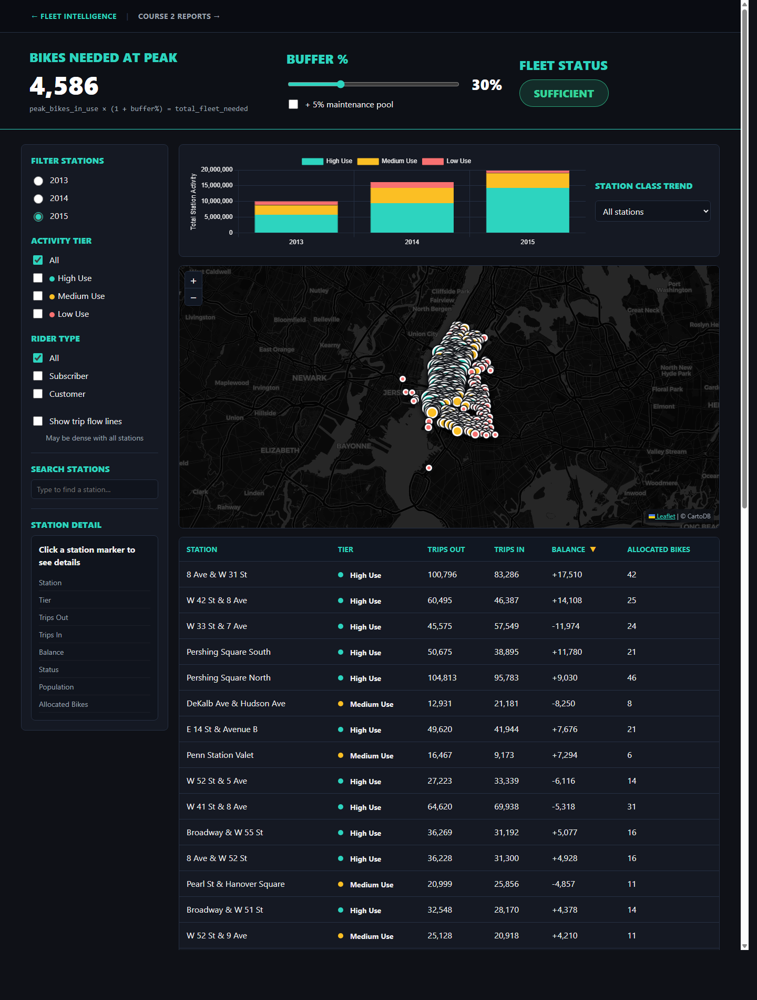

# Cyclistic Fleet Intelligence Dashboard

> **Google Business Intelligence Certificate — Portfolio Project**
> Built by [Chris Hainlen](https://linkedin.com/in/chainlen) · [Groveline LLC](https://groveline.ai) · May 2026

---



▶ **[Watch the 3-minute walkthrough](#)** *(Loom link coming soon)*

---

## The Question

> Does Cyclistic have enough bikes at the right station locations to meet rider demand across NYC?

A station with low trip counts isn't necessarily low-demand — it may simply be under-supplied. This project tries to separate those two realities and give the Customer Growth Team a defensible basis for fleet sizing, station placement, and rebalancing priorities.

---

## Why This Project Exists

**The first question isn't "which stations are busiest." It's "do we have enough bikes."**

Fleet health is the executive question. Total bikes in system, minus bikes in use, minus maintenance buffer equals available inventory. A dashboard that leads with trip counts is describing the past. A dashboard that leads with fleet sufficiency is driving a decision.

The send/return balance insight came from watching this problem in the real world. Scooter rebalancing trucks in NYC are expensive proof that bad fleet distribution is an operational cost. Busy stations that both send and receive bikes are self-sustaining. Drain stations are the problem to solve. The hypothesis here is that right-sized fleet plus right-sized station design reduces the need for active rebalancing.

**Why HTML instead of Tableau:**

Leaflet.js gave us a purpose-built interactive NYC map with CartoDB dark tiles, tier-colored markers sized by trip volume, directional flow lines, and click-to-detail station cards. The buffer slider updates client-side with no re-query. The linked filters between map and companion table, the dual-persona layout — these patterns come naturally from code.

Building in HTML also means this is already a working prototype for a Next.js or React production frontend. The API calls, endpoints, SQL queries, data schemas, and model shapes are figured out. Tableau is a dead end. HTML is a starting point.

**Why A3 thinking:**

A3 was top of mind coming out of the HubSpot RevOps certification. It maps cleanly onto BI problem definition and produces a document that works at every level simultaneously. The goal and solution for the executive. The analysis questions and data design for the analyst. The full decision trail for anyone who picks this up cold. That's the standard this project was held to.

**The bigger picture:**

25 years of fund infrastructure — ODD frameworks, trade settlement automation, compliance systems, allocator relationships — is BI and RevOps work. It happened inside a specialized industry with specialized vocabulary. The Google BI Certificate translates what was built in alternative investments into language that mainstream technology and enterprise companies recognize. The certs fill vocabulary gaps. The AI fills execution gaps. The 25 years fills judgment gaps.

---

## Datasets

| Source | Description | Used For |
|--------|-------------|----------|
| `bigquery-public-data.new_york_citibike.citibike_trips` | Every trip start/end station, time, bike ID, rider type, 2013–2015 | Primary analysis |
| `bigquery-public-data.geo_us_boundaries.zip_codes` | Zip code polygons for spatial joins | Borough/neighborhood labels |
| `bigquery-public-data.noaa_gsod` | NOAA daily weather, Central Park station (wban 94728) | Weather impact layer |
| `bigquery-public-data.geo_census_tracts` + `census_bureau_acs` | Census tract boundaries and population | Latent demand zones |
| `YOUR_PROJECT.cyclistic.zip_codes` | User-uploaded NYC zip → borough/neighborhood CSV | Geographic enrichment |

The Census population layer serves two purposes: data quality validation (low trips in a high-density area signals under-supply, not low demand) and directional demand forecasting (population growth is a leading indicator that trip data alone cannot provide).

---

## A3 Framework

Project thinking is structured as an A3 — a lean problem-solving format that keeps the goal, current conditions, analysis, and countermeasures on one page. It was chosen because it produces a document that works for executives, analysts, and new team members simultaneously.

See the full A3 documents:
- **Course 1 A3:** [docs/C1 A3.md](docs/c1_a3.md)
- **Course 2 A3 (data preparation):** [docs/C2 A3.md](docs/c2_a3.md)

In short:

- **Goal:** Ensure sufficient bikes at the right stations to meet NYC rider demand
- **Current conditions:** Uneven station demand, no visibility into whether low-activity stations are under-demanded or under-supplied
- **Targets:** Activity tiers via percentile reference lines, send/return balance matrix, fleet size = peak demand + 30% buffer + 5% maintenance pool, population-adjusted latent demand zones
- **Analysis questions:** Station activity tiers, send/return balance (drain vs accumulator vs balanced), seasonal and rider-type variation, future demand from population shifts

---

## Project Documents

### Course 1 — Project Planning

| Document | Description |
|----------|-------------|
| [Course 1 A3](docs/c1_a3.md) | Lean problem statement, current conditions, targets, analysis questions, and countermeasures |
| [Stakeholder Requirements](docs/c1_stakeholder_requirements.md) | Business problem, stakeholder roster, accessibility requirements (Sara Romero), privacy approval (Jamal Harris), primary requirements |
| [Project Requirements](docs/c1_project_requirements.md) | Dataset fields, deliverables, metrics definitions, 6-week rollout plan, success criteria |
| [Strategy Document](docs/c1_strategy_document.md) | Dashboard design, three chart outlines with dimensions and metrics, milestone table |

### Course 2 — Data Preparation

| Document | Description |
|----------|-------------|
| [Course 2 A3](docs/c2_a3.md) | A3 framing for the data preparation stage: why the reporting tables were designed the way they were, what questions the weather and zip code joins were meant to answer |
| [Stakeholder Requirements](docs/c2_stakeholder_requirements.md) | Updated stakeholder needs as the project moved from planning to pipeline |
| [Project Requirements](docs/c2_project_requirements.md) | Course 2 metrics, target table specifications, dual-persona dashboard requirements (Ernest Cox executive view vs Tessa Blackwell analyst view) |
| [Strategy Document](docs/c2_strategy_document.md) | Pipeline architecture, ETL decisions, reporting table design rationale |
| [Planning Document](docs/C2_Planning_Document.md) | Milestone tracking for Course 2 deliverables |

### Dashboard UX

| Document | Description |
|----------|-------------|
| [UX Requirements](docs/planning/ux_requirements.md) | Full dashboard specification: hero section, map controls, station detail card, companion table, seasonal chart, population context layer, accessibility requirements, resolved design decisions |

---

## SQL Queries

11 BigQuery SQL queries numbered in execution order. Each query has a comment block explaining what it does, what dashboard view it supports, and what assumptions it makes.

| File | Purpose |
|------|---------|
| [01_station_classification.sql](backend/data/sql/01_station_classification.sql) | Station activity tiers using 33rd/66th percentile reference lines, 2013–2015 |
| [02_user_type_classification.sql](backend/data/sql/02_user_type_classification.sql) | Subscriber vs casual breakdown per station per year |
| [03_census_growth_distribution.sql](backend/data/sql/03_census_growth_distribution.sql) | Census tract population distribution check |
| [04_station_census_overlay.sql](backend/data/sql/04_station_census_overlay.sql) | 1-mile radius population overlay per station |
| [05_directional_route_flows.sql](backend/data/sql/05_directional_route_flows.sql) | Station-to-station flow lines and safe zone classification |
| [06_seasonal_trends.sql](backend/data/sql/06_seasonal_trends.sql) | Trip volume by meteorological season, year, and rider type |
| [07_fleet_buffer_calc.sql](backend/data/sql/07_fleet_buffer_calc.sql) | Peak concurrent bikes in use — foundation of the buffer calculator |
| [08_daily_station_balance.sql](backend/data/sql/08_daily_station_balance.sql) | Daily net departures per station (drain / accumulator / balanced) |
| [09_destination_popularity.sql](backend/data/sql/09_destination_popularity.sql) | Destination stations ranked by total trip minutes received |
| [10_reporting_table_full_year.sql](backend/data/sql/10_reporting_table_full_year.sql) | Course 2 materialized reporting table — full year 2014–2015 with weather and geography joins |
| [11_reporting_table_summer.sql](backend/data/sql/11_reporting_table_summer.sql) | Course 2 materialized reporting table — July–September only |

---

## Dashboard

Two HTML pages, self-contained, no build step required.

**[dashboard.html](frontend/source/dashboard.html)** — Fleet Intelligence (primary)
- Hero fleet calculator with live buffer slider (10–50%, default 30%) and maintenance pool toggle
- Green/yellow/red fleet status indicator
- Leaflet NYC map with activity tier and rider type filters, directional flow lines, station detail cards
- Collapsible *Filters* carrot in the sidebar with a **Refresh from Google** button and last-extract timestamp — triggers the backend extract API and re-renders the dashboard in place
- Companion table sorted by send/return balance (drain stations at top), with a draggable Selected pin section and a per-row Refill badge
- Pair-flow detail: pin two stations to see avg trips/day in each direction on the map and in the detail card
- Seasonal trend chart — three-year overlay with percentile reference lines
- Per-season detail and Typical Season Profile tables with NOAA Central Park climate norms and a Demand Index for fleet sizing

**[course2_reports.html](frontend/source/course2_reports.html)** — Course 2 Reports
- Weather impact scatter chart (precipitation vs trip count, 2014/2015)
- Borough breakdown bar charts (summer and full year)
- Dual-persona view: executive KPI strip (Ernest Cox) + analyst drill-down table (Tessa Blackwell)

---

## Deliverables

| # | Deliverable | Status |
|---|-------------|--------|
| 1 | Course 1 A3 framing | ✅ Complete |
| 2 | Station classification SQL | ✅ Complete |
| 3 | User-type station classifier | ✅ Complete |
| 4 | Census growth distribution | ✅ Complete |
| 5 | Census one-mile station overlay | ✅ Complete |
| 6 | Directional route flows | ✅ Complete |
| 7 | Send/return balance matrix | ✅ Complete (in dashboard) |
| 8 | Fleet buffer calculator SQL | ✅ Complete |
| 9 | Daily station balance | ✅ Complete |
| 10 | Destination popularity | ✅ Complete |
| 11 | Seasonal trends SQL | ✅ Complete |
| 12 | Population overlay | ✅ Complete |
| 13 | Fleet Intelligence Dashboard | ✅ Complete |
| 14 | Executive summary | ✅ Complete |
| 15 | Course 2 A3 | ✅ Complete |
| 16 | Course 2 planning documents | ✅ Complete |
| 17 | Reporting table — full year | ✅ Complete |
| 18 | Reporting table — summer | ✅ Complete |
| 19 | Course 2 Reports page | ✅ Complete |

---

## Repository Layout

```
bike_bi/
├── docker-compose.yml
├── .dockerignore
├── .env.example                Extract configuration template
├── backend/
│   ├── Dockerfile
│   ├── requirements.txt        Python dependencies
│   ├── app/
│   │   ├── api/
│   │   │   └── server.py       FastAPI service: POST /api/extract, GET /api/extract/status
│   │   └── src/
│   │       └── extract.py      BigQuery → CSV export pipeline (CLI + invoked by API)
│   └── data/
│       ├── *.csv               Dashboard CSV outputs (gitignored)
│       ├── .last_extract.json  Persisted last-success timestamp for the refresh API
│       └── sql/                11 BigQuery queries, numbered in execution order
├── frontend/
│   ├── Dockerfile
│   ├── nginx.conf
│   └── source/
│       ├── dashboard.html      Fleet Intelligence Dashboard (primary)
│       └── course2_reports.html
├── docs/
│   ├── c1_a3.md
│   ├── c1_project_requirements.md
│   ├── c1_stakeholder_requirements.md
│   ├── c1_strategy_document.md
│   ├── c2_a3.md
│   ├── C2_Planning_Document.md
│   ├── c2_project_requirements.md
│   ├── c2_stakeholder_requirements.md
│   ├── c2_strategy_document.md
│   └── planning/
│       └── ux_requirements.md  Dashboard UX specification
└── README.md
```

---

## Setup and Run

**Public BigQuery datasets (free tier, no upload required):**

```
bigquery-public-data.new_york_citibike
bigquery-public-data.geo_us_boundaries
bigquery-public-data.geo_census_tracts
bigquery-public-data.census_bureau_acs
bigquery-public-data.noaa_gsod
```

**One-time upload (Course 2):**

Upload the NYC zip code CSV via BigQuery console → **+ Add Data → Local file**. Auto-detect schema. Name the table `YOUR_PROJECT.cyclistic.zip_codes`. Expected columns: `zip`, `borough`, `neighborhood`.

**Local Python setup:**

```bash
python3 -m venv .venv
source .venv/bin/activate
pip install -r backend/requirements.txt
cp .env.example .env
```

Edit `.env`:

```dotenv
ROOT_DIR=backend
SQL_DIR=data/sql
DATA_DIR=data
YEAR_FROM=2015
YOUR_PROJECT=YOUR_PROJECT_ID
GOOGLE_AUTH_LAUNCH=false
```

Set `GOOGLE_AUTH_LAUNCH=true` when you want `backend/app/src/extract.py` to launch `gcloud auth application-default login` and set the active gcloud project from `YOUR_PROJECT`. Leave it `false` if your local Google credentials are already configured.

If you use a service account instead of gcloud ADC, add `GOOGLE_APPLICATION_CREDENTIALS=/absolute/path/to/service-account.json` to `.env`.

**Run queries in BigQuery console:**

Paste SQL files from `backend/data/sql/` in numbered order. Queries 10 and 11 use `CREATE OR REPLACE TABLE` to materialize reporting tables — replace `YOUR_PROJECT` with your GCP project ID before running.

**Refresh dashboard data:**

```bash
python backend/app/src/extract.py
```

Outputs CSVs to `backend/data/`. Open `frontend/source/dashboard.html` directly in a browser — no server required.

**Docker setup:**

```bash
docker compose up --build
```

Brings up two services:

- `frontend` (nginx on `http://localhost:8080`) — serves `frontend/source/` and reads CSVs from the shared Docker `backend-data` volume.
- `backend-api` (FastAPI/uvicorn) — exposes `POST /api/extract`, `GET /api/extract/status`, and temporary Google credential endpoints. The frontend proxies `/api/` to this service.

The dashboard sidebar's *Filters* carrot has a **Gather Google Credentials** button and a **Refresh from Google** button with the last-extract timestamp next to it. Gather credentials first by pasting a short-lived Google OAuth access token and Google Cloud project ID; the backend keeps both in memory only and does not write them to `.env`. Then click Refresh from Google to trigger a BigQuery pull; the button polls status and re-renders the dashboard when CSVs are rewritten — no page reload. State persists to `backend/data/.last_extract.json` so the timestamp survives container restarts.

Before gathering credentials, create or choose a Google Cloud project:

- Console: [Create a Google Cloud project](https://console.cloud.google.com/projectcreate)
- Docs: [Creating and managing projects](https://cloud.google.com/resource-manager/docs/creating-managing-projects)

Make sure the project has billing enabled if required by your Google account, and that the signed-in user can run BigQuery jobs against public datasets.

To gather a short-lived token from the command line:

```bash
gcloud auth application-default login
gcloud config set project YOUR_PROJECT_ID
gcloud auth application-default print-access-token
```

Paste the printed token and `YOUR_PROJECT_ID` into **Gather Google Credentials**. The token is short-lived; if refresh fails later with an auth error, gather a new token and retry.

Useful Google references:

- [Application Default Credentials command group](https://cloud.google.com/sdk/gcloud/reference/auth/application-default)
- [Print an ADC access token](https://docs.cloud.google.com/sdk/gcloud/reference/auth/application-default/print-access-token)
- [OAuth 2.0 Playground](https://developers.google.com/oauthplayground/) if you prefer a browser-based token flow

For one-shot CLI extraction (no API) the existing profile still works:

```bash
docker compose run --rm backend
```

`docker-compose.yml` uses a named Docker volume for `backend/data`, avoiding WSL bind mounts. The **Gather Google Credentials** flow is the preferred Docker path because the token stays in backend memory and expires quickly. `GOOGLE_AUTH_LAUNCH=true` is only meaningful for local host runs where `gcloud` is installed — the API service does not launch a browser flow.

---

## Key Insights

Six findings that came out of the data:

1. **Size for summer, not annual average** — Summer accounts for ~65% of annual trips. Winter 2015 polar vortex was an outlier, not a planning baseline.
2. **Fleet formula** — Peak concurrent bikes × (1 + buffer%) = total fleet needed. Default 30% buffer plus 5% maintenance pool.
3. **Drain stations ≠ low demand** — Stations with more departures than arrivals deplete inventory. System gravity moves bikes toward busy hubs organically.
4. **Latent demand zones** — Three station catchment areas show low trips but high census population density. Under-supplied, not under-demanded.
5. **Subscribers ride in worse weather** — Casual customers are more sensitive to precipitation than annual subscribers.
6. **Borough growth trajectory** — Manhattan dominates current volume but Brooklyn shows the strongest growth 2013–2015.

---

## About

Built as the end-of-course portfolio project for the [Google Business Intelligence Certificate](https://grow.google/certificates/business-intelligence/), completed May 2026.

**Chris Hainlen** — Operations executive, 25 years in alternative investments and fintech. Founder of [Groveline LLC](https://groveline.ai) and creator of [Vialine.io](https://vialine.io).

[LinkedIn](https://linkedin.com/in/chainlen) · [GitHub](https://github.com/chainlen-ship-it)
